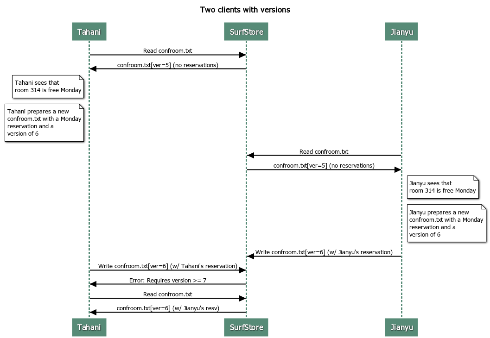

<p align="center"></p>
<p align="center"></p>

<p align="center">


[](https://opensource.org/licenses/MIT)

</p>

Surfstore is a cloud-based file storage service modeled after Dropbox, allowing users to sync files to and from the cloud. It consists of a client and server architecture that communicates via gRPC.

## Architecture

### Components

<p align="center"></p>

Surfstore comprises of the following components:
* **Client**: Interacts with the server to upload, download, and sync files using gRPC.
* **BlockStore**: Stores file content in chunks called blocks, each identified by a unique hash. Retrieves blocks using their identifiers.
* **MetaStore**: Manages file metadata, mapping filenames to blocks. Tracks available BlockStores and maps blocks to specific BlockStores. Supports scaling to handle large amounts of data.

Surfstore implements the RAFT consensus algorithm to ensure consistent metadata across MetaStore replicas, maintaining service integrity during failures. It utilizes consistent hashing for mapping blocks to BlockStores. Each BlockStore's address is hashed using SHA-256, creating a hash ring in the MetaStore.


### Concepts
- **File Structure**: Files are divided into blocks of uniform size, except the last block. Each block's hash is computed using SHA-256, forming a hashlist representing the file.
- **Versioning**: Each file has a monotonically increasing version number that increments with modifications, allowing clients to detect outdated file views. 
  
- **Base Directory**: A specified directory that syncs with the cloud. The client uploads files from this directory to the cloud and downloads updates into it, ensuring no modifications outside this directory.
- **index.db**: Crucial for maintaining the Local Tree, representing the last known state of the user's files on disk.

### Sync Engine

Surfstore's sync engine is designed to manage file synchronization efficiently, inspired by Dropbox's three-tree approach:

- **Remote Tree**: Represents the latest state of the user's Surfstore in the cloud.
- **Local Tree**: Reflects the last observed state of the user's Surfstore on disk.
- **Synced Tree**: Captures the last known "fully synced" state between the Remote and Local Trees.

The Synced Tree is crucial since it acts as a merge base in version control systems, allowing Surfstore to derive the correct sync behavior by distinguishing between local edits and remote updates.

### Configuration

- The server is initialized with a JSON configuration file listing MetaStore and BlockStore addresses. Ensure testing with a variety of server configurations.
- For a sample configuration, refer to [example_config.json](example_config.json).

For exact project specifications, check out the [doc](doc) directory.

## Algorithm

1. The client reads the `index.db` file to build the Local Tree, representing the last observed state on disk.
2. It scans the base directory, calculates hashlists for each file, and compares them with the Local Tree. Upon detecting any new, modified, or deleted files, it updates the Local Tree.
3. This updated Local Tree becomes the Synced Tree, capturing the last known fully synced state.
4. The client retrieves the Remote Tree from the server and compares it with the Local Tree.
5. Using the Synced Tree as a reference, it identifies whether changes were made locally or remotely, enabling precise conflict resolution.
6. The server prioritizes the first client to sync during conflicts, ensuring the latest changes are preserved.
7. The client downloads updates from the cloud only when remote versions are newer and uploads local changes when necessary.
8. For more details, check out [pkg/surfstore/sync.go](pkg/surfstore/sync.go).


## Setup

```bash
# Ensure Go 1.22 or higher is installed on your machine.
$ go version

# install Protocol Compiler Plugins for Go
$ go install google.golang.org/protobuf/cmd/protoc-gen-go@v1.28
$ go install google.golang.org/grpc/cmd/protoc-gen-go-grpc@v1.2

# Add the Go binaries to your PATH
$ export PATH="$PATH:$(go env GOPATH)/bin"

# Clone the repository
$ git clone github.com/mayank-02/surfstore.git
cd surfstore

# Install dependencies
$ go mod tidy

$ protoc --proto_path=. --go_out=. --go_opt=paths=source_relative --go-grpc_out=. --go-grpc_opt=paths=source_relative pkg/surfstore/surfstore.proto

# Run the tests
$ make test
```

To individually run the servers and client, follow the instructions below:
1. Run BlockStore Server: `make run-blockstore`
2. Run RaftSurfstore Server: `make IDX=0 run-raft`
3. Run the Client: `go run cmd/SurfstoreClientExec/main.go -f config.json <baseDir> <blockSize>` where `<baseDir>` is the path to your base directory and `<blockSize>` is the desired block size for file fragmentation.
4. Run specific tests: `make TEST_REGEX=Test specific-test`
5. Clean up: `make clean`  


## Testing

- Uses the `RaftTestingInterface` for simulating node crashes and network partitions.
- Functions like `Crash()`, `MakeServerUnreachableFrom()`, and `Restore()` help test server responses and RAFT protocol adherence.

For more details, check out [pkg/test/raft_test.go](pkg/test/raft_test.go) and [pkg/test/raft_client_test.go](pkg/test/raft_client_test.go).

## References

1. [gRPC](https://grpc.io/)
2. [Raft Consensus Algorithm](https://raft.github.io)
3. [Consistent Hashing](https://en.wikipedia.org/wiki/Consistent_hashing)
4. [Dropbox Blog Post](https://dropbox.tech/infrastructure/-testing-our-new-sync-engine)
5. [Student's](https://thesquareplanet.com/blog/students-guide-to-raft/) and [Instructor's](https://thesquareplanet.com/blog/instructors-guide-to-raft/) Guide to RAFT
6. [Effective Go](https://golang.org/doc/effective_go.html)
7. [Go by Example](https://gobyexample.com/)
8. [GoDoc](https://pkg.go.dev/)

## License
This project is licensed under the MIT License - see the [LICENSE](LICENSE) file for details.
